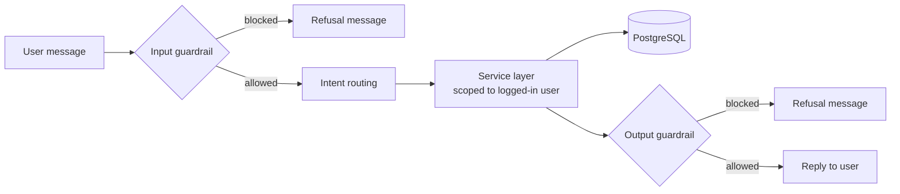
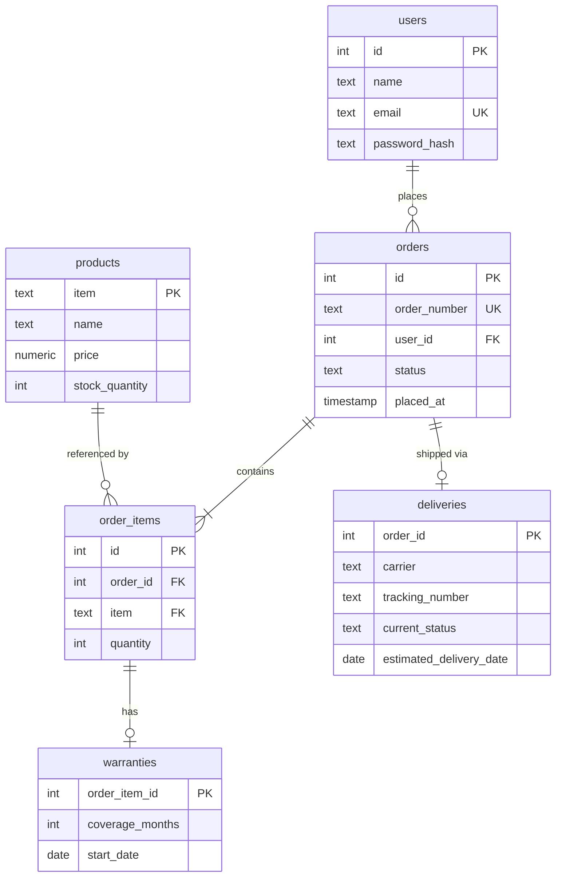

# E-commerce Customer Service Chatbot


A command-line customer service chatbot that answers questions about **products, orders, deliveries and warranties** using live data from PostgreSQL.

Users log in with an email and password. Every order, delivery and warranty lookup is then scoped to the authenticated user, so a customer can only ever see their own data. Input and output pass through configurable regex guardrails.

---

## Table of Contents

- [Features](#features)
- [How It Works](#how-it-works)
- [Project Structure](#project-structure)
- [Getting Started](#getting-started)
- [Usage](#usage)
- [Guardrails Configuration](#guardrails-configuration)
- [Database Schema](#database-schema)
- [Security Design](#security-design)
- [Known Limitations](#known-limitations)
- [Roadmap](#roadmap)

---

## Features

| Capability | Example |
|---|---|
| **Authentication** | Email and password login, verified against a salted PBKDF2 hash |
| **Order history** | `my orders` |
| **Order status** | `status of ORD-10001` |
| **Delivery tracking** | `track ORD-10001` |
| **Warranty lookup** | `warranty ORD-10001` (guided, multi-turn) |
| **Product search** | `price of phone`, `search smartwatch` |
| **Availability** | Shows price and stock level for each match |
| **Guardrails** | Regex-based screening of incoming messages and outgoing replies, configured in `config.yml` |
| **Per-user data isolation** | All order-related queries filter on the logged-in user's ID |

---

## How It Works



1. The user logs in. Their ID is stored for the session.
2. Each message is screened by the **input guardrail**.
3. The chatbot **routes** the message to an intent (orders, status, tracking, warranty, products) using keyword rules.
4. The **service layer** queries PostgreSQL. Every order-related query includes `user_id = <logged-in user>`.
5. The reply is screened by the **output guardrail** before it is displayed.

The message text decides *what* to look up. The login decides *whose* data may be looked up.

---

## Project Structure

```
.
├── main.py           # Entry point: login, chat loop, intent routing
├── services.py       # Business logic: user-scoped queries, text parsing, warranty flow
├── database.py       # PostgreSQL connection, password hashing, demo data seeding
├── guardrails.py     # Regex input/output screening loaded from config.yml
├── config.yml        # Guardrail patterns (see Guardrails Configuration)
├── schema.sql        # Table definitions
├── requirements.txt  # Python dependencies
├── .env.example      # Template for database credentials
└── README.md
```

| Module | Responsibility |
|---|---|
| `main.py` | Controller. Reads input, applies guardrails, chooses which service function to call, formats replies. |
| `services.py` | Data access and conversation logic. Holds the current user and the pending warranty follow-up state. |
| `database.py` | Opens the shared connection, hashes and verifies passwords, seeds demo users, products and orders. |
| `guardrails.py` | Loads regex patterns from `config.yml` and blocks matching input or output. |

---

## Getting Started

### Prerequisites

- Python 3.9 or newer
- PostgreSQL 12 or newer

### 1. Clone and install

```bash
git clone https://github.com/<your-username>/<your-repo>.git
cd <your-repo>

python -m venv venv
source venv/bin/activate        # Windows: venv\Scripts\activate
pip install -r requirements.txt
```

### 2. Create the database

```bash
psql -U postgres -c "CREATE USER chatbot_user WITH PASSWORD 'change-me';"
psql -U postgres -c "CREATE DATABASE chatbot_db OWNER chatbot_user;"
psql -U chatbot_user -d chatbot_db -f schema.sql
```

### 3. Configure credentials

```bash
cp .env.example .env
```

Edit `.env` so the values match the user and database you just created:

```ini
DB_HOST=127.0.0.1
DB_PORT=5432
DB_NAME=chatbot_db
DB_USER=chatbot_user
DB_PASSWORD=change-me
```

### 4. Run

```bash
python main.py
```

On startup the app inserts demo data (only if it is not already present) and prompts you to log in.

### Commands

| You type | The bot does |
|---|---|
| `my orders` | Lists all of your orders, newest first |
| `status of ORD-10001` | Shows status, order date and items |
| `track ORD-10001` | Shows carrier, tracking number, delivery status and estimated date |
| `warranty ORD-10001` | Asks which product, then shows its warranty |
| `warranty ORD-10001 PHN-X100` | Shows that product's warranty directly |
| `price of phone` | Shows matching products with price and stock |
| `search smartwatch` | Searches the catalog |
| `show all products` | Lists the full catalog |
| `exit` / `quit` / `bye` | Ends the session |

### Example session

```
You: status of ORD-10001

Bot: Order ORD-10001:
Status: delivered
Placed: 2026-09-18 10:30:00
Items: 1x PHN-X100, 1x TAB-S10

You: warranty ORD-10001

Bot: Which product would you like warranty information for in order ORD-10001?

1. Nova Phone X100 (PHN-X100)
2. Galaxy Tab S10 (TAB-S10)

Please enter the product number or item.

You: 1

Bot: Warranty for Nova Phone X100 (PHN-X100):
Coverage: 12 months
Start date: 2026-09-18
```

### Data isolation in action

Logged in as Alice, asking about Bob's order returns the same response as an order that does not exist:

```
You: status of ORD-10002

Bot: I couldn't find order ORD-10002 on your account.
```

---

## Guardrails Configuration

`guardrails.py` reads its patterns from `config.yml`, located next to the module. Patterns are regular expressions, matched case-insensitively anywhere in the text.

```yaml
rails:
  config:
    regex_detection:
      input:
        patterns:
          - 'ignore (all|previous) instructions'
          - 'reveal (the )?system prompt'
      output:
        patterns:
          - 'pbkdf2_sha256\$'
          - 'password_hash'
```

| Section | Applied to | On match |
|---|---|---|
| `input.patterns` | The user's message, before any processing | Request is refused |
| `output.patterns` | The bot's reply, before display | Reply is replaced with a refusal |

Use single quotes in YAML so backslashes in regexes are preserved.

> **Note:** these are simple pattern filters. They catch known phrasings and obvious leaks, and are meant as a safety net rather than the primary access control. Data isolation is enforced in the service layer (see below).

---

## Database Schema



The full DDL is in [`schema.sql`](schema.sql). It is idempotent and safe to re-run.

Only `orders` carries a `user_id`. Order items, warranties and deliveries inherit ownership through their parent order.

---

## Security Design

- **User-scoped queries.** Every order, delivery and warranty lookup filters on the logged-in user's ID. Child tables are only reached through an order the user owns.
- **Fail closed.** If no user is logged in, service functions return empty results.
- **Parameterized SQL.** All values are passed as query parameters, never concatenated into SQL.
- **Password hashing.** Passwords are stored as salted PBKDF2-HMAC-SHA256 hashes and compared in constant time. The stored hash embeds its own salt and iteration count.
- **Uniform failure messages.** A wrong email and a wrong password produce the same login error. A missing order and another user's order produce the same "couldn't find" reply.
- **Output screening.** Replies pass through a configurable output guardrail before display.

---

## Known Limitations

This project is a working prototype. Be aware of the following:

- **Rule-based routing.** Intent detection uses keyword matching, so phrasing must be fairly literal. `price of phone` works. `how much does the phone cost` does not.
- **`show products` returns a partial list.** The prefix-stripping in `extract_product_search_term` turns `products` into `s`, which then matches only some items. Use `show all products` for the full catalog.
- **Warranty follow-up accepts numbers only in practice.** After the product menu, reply with the list number. Typing an item code is not routed back to the warranty flow.
- **Warranty output has no expiry.** It shows coverage months and start date, but not an expiry date or active/expired status.
- **Tracking message for unshipped orders.** An order that exists but has no delivery record gets the "couldn't find order" reply.
- **Single-user process state.** The current user and pending warranty state are module-level globals, so one process serves one user. This is fine for the CLI, but not for a multi-user web service.
- **Guardrails fail open.** If `config.yml` is missing, no patterns load and nothing is filtered.
- **Password hashing cost.** 100,000 PBKDF2 iterations is below current OWASP guidance (600,000). The iteration count is stored per hash, so it can be raised for new passwords without breaking existing ones.
- **No automated tests.**

---

## Roadmap

- [ ] Fix prefix matching with word boundaries in `extract_product_search_term`
- [ ] Route item-code replies back into the warranty flow
- [ ] Return warranty expiry date and active/expired status
- [ ] Replace keyword routing with LLM tool-calling (user identity stays server-side, never model-supplied)
- [ ] Load and compile guardrail patterns once, and fail loudly when config is missing
- [ ] Pass `user_id` explicitly instead of module globals, to support a web API
- [ ] Add unit tests, including cross-user access tests
- [ ] Raise PBKDF2 iterations to current guidance
